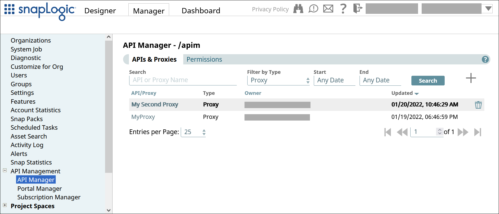
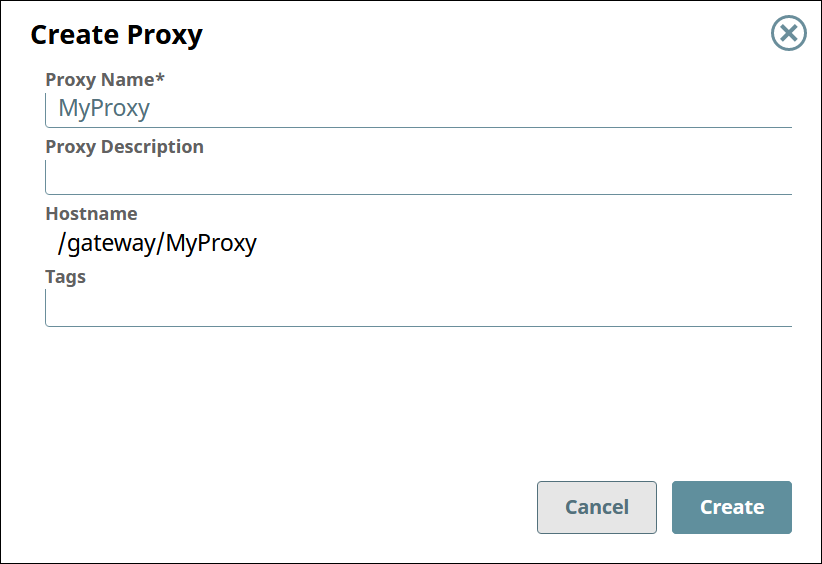

# Proxies for APIs {#proxies .concept}

Managing proxies for your APIs and third-party APIs.

## Overview { .section}

SnapLogic's proxies allow you to seamlessly integrate with your APIs and third-party APIs by providing API administration, monitoring, and security management within the API Manager.

You can:

-   [View the list of proxies.](#section-view-list-proxies)
-   [Create a proxy.](#section-create-proxy)
-   [View and edit the settings of a proxy.](https://docs-snaplogic.atlassian.net/wiki/spaces/SD/pages/2453143554/Proxy+Details)
-   [Add or remove endpoints in the proxy.](https://docs-snaplogic.atlassian.net/wiki/spaces/SD/pages/2453372929/Proxy+Endpoints)
-   [Delete a proxy.](#section-delete-proxy)
-   [Manage security policies to control access to the proxy and its endpoints.](https://docs-snaplogic.atlassian.net/wiki/spaces/SD/pages/2465399255/Proxy+Security+Policies)

## Prerequisites {#section-prerequisites .section}

-   Org Admin permissions

## Viewing the List of Proxies {#section-view-list-proxies .section}

To view the list of proxies,

1.  In SnapLogic **Manager**, go to **API Management** \> **API Manager**.
2.  In the API Manager, go to the **APIs & Proxies** tab.
3.  Set **Filter by Type** to **Proxy** and click **Search**.

## Creating a Proxy {#section-create-proxy .section}

To create a proxy,

1.  In the API Manager, go to the **APIs & Proxies** tab.
2.  Click the plus icon \(\).
3.  Select **New Proxy** from the dropdown.
4.  Configure the new proxy.

    

    |Field|Description|
    |-----|-----------|
    |**Proxy Name**|The name for your proxy.     -   Must be unique.
    -   Must begin with alphanumeric characters A-Z, a-z, or 0-9.
    -   Cannot contain the reserved keywords `apim` and `shared`.
    -   Cannot contain \|, <, \>, \[, \], \{, \}, \#, ?, /, and \\.
    -   Must be no more than 256 characters. If the name includes double-byte characters, the maximum length is shorter.
 The proxy name is appended to the **Hostname**.

|
    |**Proxy Description**|\(Optional\) Information about the proxy.|
    |**Hostname**|The prefix `/gateway/` is concatenated with the **Proxy Name**.|
    |**Tags**|\(Optional\) Tags you can use to organize your proxies.|

## Deleting a Proxy {#section-delete-proxy .section}

To delete a proxy,

1.  In the API Manager, go to the **APIs & Proxies** tab.
2.  Hover over the row of the proxy.
3.  Click the trash icon \(\) that appears at the end of the row.

-   **[Proxy Details](../apim/proxy-details.md)**  
View and edit the proxy details, choose Snaplexes to host your proxy, and apply security policies.
-   **[Proxy Endpoints](../apim/proxy-endpoints.md)**  
View and edit the endpoints for your proxy.
-   **[Proxy Endpoint Details](../apim/proxy-endpoint-details.md)**  
View and edit the endpoint details and apply security policies.
-   **[Proxy Security Policies](../apim/proxy-security-policies.md)**  
Manage and apply security policies for proxies and endpoints.

**Related information**  

[Proxy Security Policies](https://docs-snaplogic.atlassian.net/wiki/spaces/SD/pages/2465399255/Proxy+Security+Policies)

