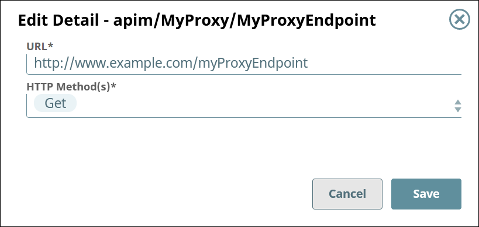

# Proxy Endpoint Details {#proxy-endpoint-details .concept}

View and edit the endpoint details and apply security policies.

## Viewing the Proxy Endpoint Settings { .section}

To view the settings of a proxy endpoint,

1.  In the API Manager, open a proxy for editing, then go to the **Proxy Endpoints** tab.
    1.  In SnapLogic **Manager**, go to **API Management** \> **API Manager**.
    2.  In the API Manager, go to the **APIs & Proxies** tab.
    3.  Set **Filter by Type** to **Proxy** and click **Search**.
    4.  Click the proxy's name in the list.
    5.  Go to the **Proxy Endpoints** tab.
2.  Click the endpoint's name in the list.

The **Proxy Endpoint Details** tab displays the details of the selected proxy.

## Editing the Proxy Endpoint Settings { .section}

To edit the **URL** and **HTTP Method\(s\)** of the endpoint, click **Edit Details**.

**Note:** You can update only the **URL** and **HTTP Method\(s\)** of the endpoint.

**Parent topic:**[Proxies for APIs](../apim/proxies.md)

**Related information**  

[Proxies for APIs](https://docs-snaplogic.atlassian.net/wiki/spaces/SD/pages/2463301901/Proxies+for+APIs)

[Proxy Security Policies](https://docs-snaplogic.atlassian.net/wiki/spaces/SD/pages/2465399255/Proxy+Security+Policies)

