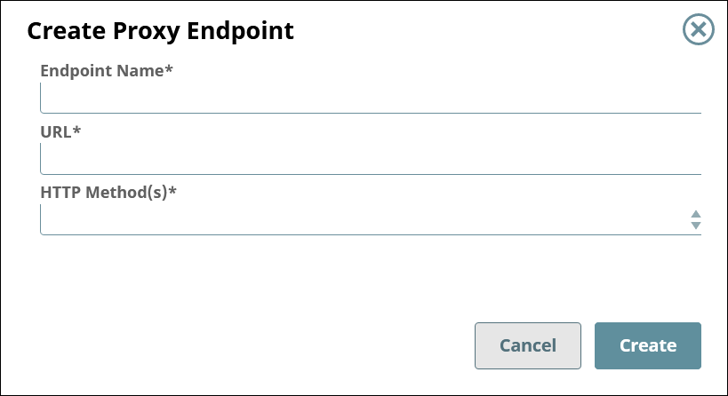

# Proxy Endpoints {#proxy-endpoints .concept}

View and edit the endpoints for your proxy.

## Overview { .section}

Proxy endpoints allow users to access your APIs and third-party APIs.

You can:

-   [View the list of endpoints for the proxy.](#section-view-list-endpoints)
-   [Create an endpoint.](#section-create-endpoint)
-   [View and edit the settings of an endpoint.](#section-edit-endpoint)
-   [Delete an endpoint.](#section-delete-endpoint)
-   [Manage security policies to control access to the endpoint.](https://docs-snaplogic.atlassian.net/wiki/spaces/SD/pages/2465399255/Proxy+Security+Policies)

## Prerequisites {#section-prerequisites .section}

-   Org Admin permissions

## Viewing the List of Endpoints {#section-view-list-endpoints .section}

To view the list of endpoints for a proxy,

1.  In SnapLogic **Manager**, go to **API Management** \> **API Manager**.
2.  In the API Manager, go to the **APIs & Proxies** tab.
3.  Set **Filter by Type** to **Proxy** and click **Search**.
4.  Click the proxy's name in the list.
5.  Go to the **Proxy Endpoints** tab.

## Creating an Endpoint {#section-create-endpoint .section}

To create an endpoint,

1.  In the API Manager, open a proxy for editing, then go to the **Proxy Endpoints** tab.
2.  Click the plus icon \(\).
3.  Configure the new endpoint.

    

    |Field|Description|
    |-----|-----------|
    |**Endpoint Name**|The name for your proxy's endpoint.     -   Must be unique.
    -   Must begin with alphanumeric characters A-Z, a-z, or 0-9.
    -   Cannot contain the reserved keywords `apim` and `shared`.
    -   Cannot contain \|, <, \>, \[, \], \{, \}, \#, ?, /, and \\.
    -   Must be no more than 256 characters. If the name includes double-byte characters, the maximum length is shorter.
|
    |**URL**|The URL to which users send their requests. Example: `https://www.example.com/path/to/the/api`

|
    |**HTTP Method\(s\)**|One or more REST methods for the API that this endpoint will service.     -   Get
    -   Put
    -   Head
    -   Post
    -   Patch
    -   Delete
|

## Editing an Endpoint {#section-edit-endpoint .section}

To edit an endpoint,

1.  In the API Manager, open a proxy for editing, then go to the **Proxy Endpoints** tab.
2.  Click the endpoint's name in the list.

    

    Learn more: [Proxy Endpoint Details](https://docs-snaplogic.atlassian.net/wiki/spaces/SD/pages/2453078030/Proxy+Endpoint+Details)

3.  To edit the proxy details, click the **Edit Details** button.

    **Note:** You can update only the **URL** and **HTTP Method\(s\)** of the endpoint.

4.  To apply security policies to the endpoint, click the plus icon \(\) below the **View Applied Policies** button.

## Deleting an Endpoint {#section-delete-endpoint .section}

To delete an endpoint,

1.  In the API Manager, open a proxy for editing, then go to the **Proxy Endpoints** tab.
2.  Check the box for the endpoint to delete.
3.  Click the trash icon \(\).

**Parent topic:**[Proxies for APIs](../apim/proxies.md)

**Related information**  

[Proxies for APIs](https://docs-snaplogic.atlassian.net/wiki/spaces/SD/pages/2463301901/Proxies+for+APIs)

[Proxy Security Policies](https://docs-snaplogic.atlassian.net/wiki/spaces/SD/pages/2465399255/Proxy+Security+Policies)

