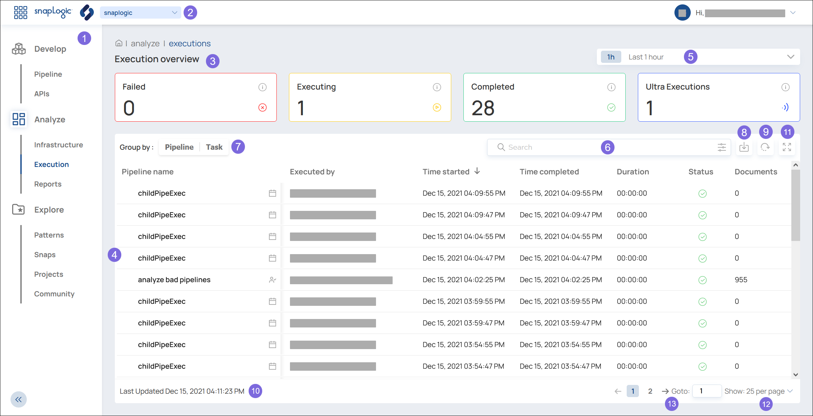

# BETA \| Analyze: Execution Overview {#analyze-execution .concept}

How to use the Execution Overview.

In the **Execution Overview**, you can see information about running Executions and completed Executions of Pipelines and Tasks at a glance.

1.  Choose the SnapLogic Studio feature from the left navigation.
    -   To expand the navigation panel, click .
    -   To collapse the navigation panel, click .
2.  Choose your Org from the dropdown.
3.  The **Execution overview** cards display the number of Pipeline and Task Executions that match the filter.
    -   Failed — The number of Executions that failed.
    -   Executing — The number of Executions that are currently running.
    -   Completed — The number of Executions that have successfully completed.
    -   Ultra Executions — The number of Ultra Executions that were started, including failed runs and successful runs.
4.  The table displays the list of Pipeline and Task Executions that match the filter.
    -   To view more details about a specific Execution, click the row of the Execution to view. Learn more: [Execution Detail](analyze-execution-detail.md)
    -   To sort the table, click the column header for the field to sort by.
5.  Filter the list of Executions by time or date.
    -   The last hour
    -   The last 8 hours
    -   The last 24 hours
    -   A specific calendar date
6.  Filter the list of Executions by search criteria.
    -   Search by any string or conditional expression.
    -   Click :
        -   To define an advanced search based on a number of fields.
        -   To select which columns are displayed.
7.  Group the results based on the Pipeline or the Task. If both are deselected, the list is not grouped.
8.  Export the current result list into a local CSV file.
9.  Refresh the list to pick up any changes since the last update of the list.
10. View the time that the list was last refreshed.
11. Expand the list and hide the Execution Overview cards. Or collapse the list and show the cards.
12. Change the number of items displayed in each page.
13. Switch to the previous page, the next page, or a specific page number.

-   **[BETA \| Analyze: Execution Details](../sl-studio/analyze-execution-detail.md)**  
Details about a specific Execution.

**Parent topic:**[BETA \| SnapLogic Studio](../sl-studio/about-studio.md)

