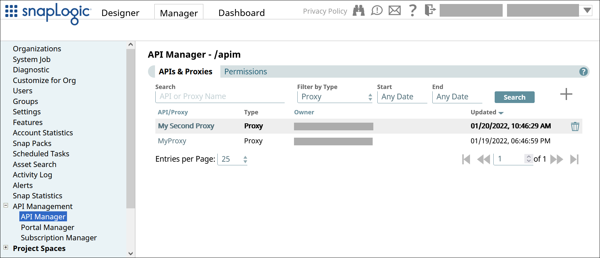

# Proxy Details {#proxy-details .concept}

View and edit the proxy details, choose Snaplexes to host your proxy, and apply security policies.

## Viewing the Proxy Settings { .section}

To view the settings of a proxy,

1.  In the API Manager, go to the **APIs & Proxies** tab.
    1.  In SnapLogic **Manager**, go to **API Management** \> **API Manager**.
    2.  In the API Manager, go to the **APIs & Proxies** tab.
    3.  Set **Filter by Type** to **Proxy** and click **Search**.
2.  Click the proxy's name in the list.

The **Proxy Details** tab displays the details of the selected proxy.

## Editing the Proxy Settings { .section}

To edit the **Description** and **Tags** of the proxy, click **Edit Details**.

**Note:** You can update only the **Description** and **Tags** of the proxy.

## Choosing Proxy Hosts { .section}

To choose which Snaplexes host your proxy, click **View URL\(s\)** under **Proxy Hosts**.

The suffixes of the URLs are the proxy's **Hostname** setting, which includes the **Proxy Name**.

**Parent topic:**[Proxies for APIs](../apim/proxies.md)

**Related information**  

[Proxies for APIs](https://docs-snaplogic.atlassian.net/wiki/spaces/SD/pages/2463301901/Proxies+for+APIs)

[Proxy Security Policies](https://docs-snaplogic.atlassian.net/wiki/spaces/SD/pages/2465399255/Proxy+Security+Policies)

