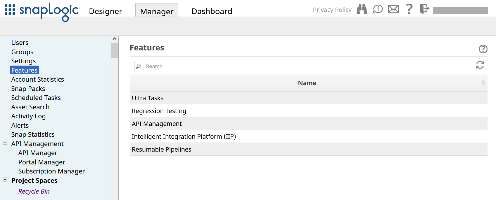

# SnapLogic Features for Orgs {#manager-features .concept}

Features available to Orgs.

Depending on your SnapLogic Org’s configuration and your security authorization, several SnapLogic platform features can be available to you in **Manager** \> **Features**.

To request access to a feature that does not appear in your Features list, contact support@snaplogic.com.

|Feature|Description|
|-------|-----------|
|[API Management](https://docs-snaplogic.atlassian.net/wiki/spaces/SD/pages/1402142725)|The API Management feature allows you to easily manage APIs within the SnapLogic Intelligent Integrated Platform \(IIP\): -   Bundle and publish your Ultra and Triggered Tasks as Proxies using a four-step wizard.
-   Manage a range of API Policies for web applications that consume APIs in SnapLogic. These API Policies include:
    -   Basic Authentication
    -   IP Restriction
    -   Rate Limiting
    -   Request and Response Transformers
    -   Cross-Origin Sharing \(CORs\)
    -   OAuth 2.0 integration
-   Review analytics, such as historical API usage and performance metrics.
-   View your APIs in the Open API Specification format.

|
|[Data Catalog Service](https://docs-snaplogic.atlassian.net/wiki/spaces/SD/pages/730006083)|Data Catalog Service allows you to save, manage, and retrieve metadata about data stored in external file systems, such as S3, so you can query the actual source data, even without knowing its location.|
|[Enhanced Account Encryption](https://docs-snaplogic.atlassian.net/wiki/spaces/SD/pages/1437994)|With Enhanced Account Encryption, you can store and use your own keys for encrypting account information in a Groundplex. The account information can be decrypted only in Groundplex nodes that have the private key.|
|[Enhanced Email Encryption](https://docs-snaplogic.atlassian.net/wiki/spaces/SD/pages/2317320252/Email+Encryption)|With Email Encryption, Org administrators can add keys to a user to encrypt that user's emails.|
|[Fast Data Loader \(FDL\)](https://docs-snaplogic.atlassian.net/wiki/spaces/SD/pages/1942159838/SnapLogic+Fast+Data+Loader)|SnapLogic Fast Data Loader \(FDL\) is a data ingestion tool that simplifies the tasks of replicating data and synchronizing data for data analysts and business analysts. You can quickly load data from your cloud applications into a cloud data warehouse, using FDL's simple point-and-click user interface.|
|[Flows](https://www.snaplogic.com/resources/data-sheets/snaplogic-flows)|SnapLogic Flows are templates for common business processes that you can use to build and manage integrations easily. **Note:** Flows is included in your SnapLogic subscription, currently free of charge for a limited time. To get started, [register for Flows](https://www.snaplogic.com/products/snaplogic-flows).

|
|Intelligent Integration Platform \(IIP\)|SnapLogic’s Intelligent Integration Platform \(IIP\) uses AI-powered workflows to automate all stages of IT integration projects – design, development, deployment, and maintenance – whether on-premises, in the cloud, or in hybrid environments.|
|[OEM](https://docs-snaplogic.atlassian.net/wiki/spaces/SD/pages/2411331647)|The Custom Org Branding \(or OEM\) feature allows you to customize the appearance \(such as the colors and logo\) of your SnapLogic platform for each Org.|
|[Regression Testing](https://docs-snaplogic.atlassian.net/wiki/spaces/SD/pages/1094811693/Automated+Regression+Tests)|You can automate regression testing against your Pipelines before and after a Snaplex upgrade. You can run the regression tests on the Pipelines in an Org at the Project level.|
|[Resumable Pipelines](https://docs-snaplogic.atlassian.net/wiki/spaces/SD/pages/721944618)|If a target endpoint becomes unavailable, a Resumable Pipeline pauses processing, instead of failing and stopping altogether. When the endpoint becomes available again and you restart the suspended Pipeline, the Resumable Pipeline continues processing where it paused, instead of restarting from the beginning.|
|[Ultra Pipelines and Tasks](https://docs-snaplogic.atlassian.net/wiki/spaces/SD/pages/1437955)|An Ultra Task continuously runs its associated Ultra Pipeline. This always-on execution provides fast responses with low latency and high throughput.|

