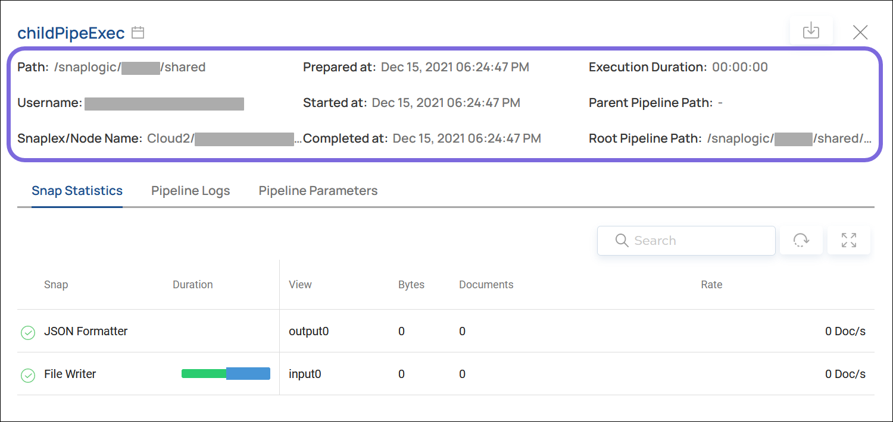
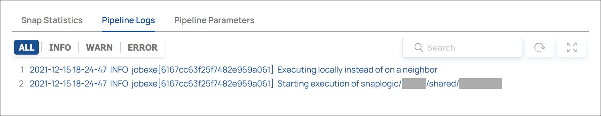
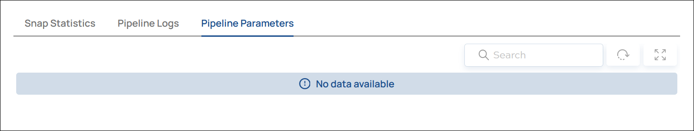

# BETA \| Analyze: Execution Details {#analyze-execution-detail .concept}

Details about a specific Execution.

When you click a row in the **Execution Overview**, you can view the details of that Execution, including information about the Snaps and Pipelines within the Execution.

## Execution Metadata { .section}

The Execution details panel includes the metadata about the Execution.

|Field|Description|
|-----|-----------|
|Path|The location of the Pipeline.|
|Username|The user account associated with the Execution.|
|Snaplex/Node Name|The Snaplex where the Execution happened.|
|Prepared at|The date and time when the Execution was configured.|
|Started at|The date and time when the Execution started running.|
|Completed at|The date and time when the Execution completed.|
|Execution Duration|The length of time the Execution ran; the difference between **Started at** and **Completed at**.|
|Parent Pipeline Path|The path to the parent Pipeline that triggered a child Pipeline included in this Execution.|
|Root Pipeline Path|The path to the highest-level ancestor Pipeline that triggered a child Pipeline included in this Execution. If the parent Pipeline has no parent of its own, it is also the root Pipeline.|

## Snap Statistics { .section}

The **Snap Statistics** tab shows information about each Snap included in the Execution.

|Field|Description|
|-----|-----------|
|Snap|The name of the Snap included in the Execution.|
|Duration|A colored bar that indicates the lengths of time that the Snap took to complete each process, relative to the total time. -   A green segment indicates the input time.
-   A blue segment indicates the execution time.
-   A purple segment indicates the output time.

 **Tip:** Hover over the bars to show a legend with the exact lengths of time.

|
|View|The name of an input or output port of the Snap. The data in the **Bytes**, **Documents**, and **Rate** columns are associated with the indicated View.|
|Bytes|The number of bytes that passed through the indicated View.|
|Documents|The number of documents that passed through the indicated View.|
|Rate|The throughput of the indicated View \(number of documents that passed through per second\).|

## Pipeline Logs { .section}

The **Pipeline Logs** tab shows the log entries that were generated during the Execution.

|Filter|Description|
|------|-----------|
|**All**|All log entries associated with the Execution.|
|**Info**|Only informational messages.|
|**Warn**|Only warning messages during the Execution.|
|**Error**|Only error messages that occurred during the Execution.|

## Pipeline Parameters { .section}

If the Pipelines in the Execution required parameters, the **Pipeline Parameters** tab shows information about the parameters passed to the Pipeline.

Learn more: [Pipeline Properties](https://docs-snaplogic.atlassian.net/wiki/spaces/SD/pages/1438254/Pipeline+Properties)

**Parent topic:**[BETA \| Analyze: Execution Overview](../sl-studio/analyze-execution.md)

